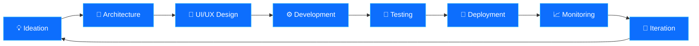

<div align="center">

<!-- ═══════════════════════════════════════════════════════════════ -->
<!-- ANIMATED CAPSULE HEADER -->
<!-- ═══════════════════════════════════════════════════════════════ -->

<a href="https://github.com/mokashreef">

</a>

<!-- ═══════════════════════════════════════════════════════════════ -->
<!-- TYPING SVG ANIMATION -->
<!-- ═══════════════════════════════════════════════════════════════ -->

<br>

<a href="https://git.io/typing-svg">

</a>

<br>

<!-- ═══════════════════════════════════════════════════════════════ -->
<!-- VISITOR COUNTER -->
<!-- ═══════════════════════════════════════════════════════════════ -->


&nbsp;
<a href="https://github.com/mokashreef?tab=followers">

</a>
&nbsp;
<a href="https://github.com/mokashreef?tab=repositories">

</a>

<br><br>

<!-- ═══════════════════════════════════════════════════════════════ -->
<!-- SOCIAL BUTTONS -->
<!-- ═══════════════════════════════════════════════════════════════ -->

<a href="https://code-elta6ur.com" target="_blank">

</a>
&nbsp;
<a href="https://linkedin.com/in/mohammad-abu-kashreef" target="_blank">

</a>
&nbsp;
<a href="https://facebook.com/mo.a.kashreef" target="_blank">

</a>
&nbsp;
<a href="https://instagram.com/mo.kashreef" target="_blank">

</a>
&nbsp;
<a href="https://paypal.me/syrmoha" target="_blank">

</a>

</div>

<br>

<!-- ═══════════════════════════════════════════════════════════════ -->
<!-- HORIZONTAL DIVIDER -->
<!-- ═══════════════════════════════════════════════════════════════ -->


<br>

<!-- ═══════════════════════════════════════════════════════════════ -->
<!-- ABOUT SECTION -->
<!-- ═══════════════════════════════════════════════════════════════ -->

<div align="center">

##  &nbsp; Who I Am

</div>

<table align="center">
<tr>
<td width="50%" valign="top">

### 🧑‍💻 &nbsp; About Me

```yaml
name: Mohammad
role: Software Engineer & Full Stack Web Developer
company: Code Elta6ur (Founder)
location: Building the future of Arabic programming
mindset: Long-term thinker | Always learning
```

- 🔭 &nbsp; **Currently building** — [Code Elta6ur](https://code-elta6ur.com), an Arabic programming platform
- 🧠 &nbsp; **Passionate about** — AI, Automation & Developer Tools
- 🏗️ &nbsp; **Focused on** — Scalable software architecture
- 💡 &nbsp; **Philosophy** — Turn ideas into real, impactful products
- ⚡ &nbsp; **Fun fact** — I think in systems, not just code

</td>
<td width="50%" valign="top">

### 🎯 &nbsp; Current Focus

```js
const mohammad = {
    mission: "Build one of the best Arabic programming platforms",
    building: ["Code Elta6ur", "Developer Tools", "Open Source"],
    learning: ["AI/ML", "System Design", "Cloud Architecture"],
    goals_2026: [
        "Scale Code Elta6ur to thousands of users",
        "Launch open source developer tools",
        "Build a strong Arabic dev community"
    ]
};
```

</td>
</tr>
</table>

<br>


<br>

<!-- ═══════════════════════════════════════════════════════════════ -->
<!-- MISSION SECTION -->
<!-- ═══════════════════════════════════════════════════════════════ -->

<div align="center">

## 🚀 &nbsp; Mission

<br>


<br>

> **Every developer deserves to learn and create in their own language.**
> Code Elta6ur exists to make programming accessible, powerful, and inspiring for the Arabic-speaking world.

<br>

</div>


<br>

<!-- ═══════════════════════════════════════════════════════════════ -->
<!-- TECH STACK -->
<!-- ═══════════════════════════════════════════════════════════════ -->

<div align="center">

## 🛠️ &nbsp; Tech Stack

<br>

<!-- LANGUAGES -->

<details open>
<summary><b>⚡ &nbsp; Languages</b></summary>
<br>


</details>

<!-- FRONTEND -->

<details open>
<summary><b>🎨 &nbsp; Frontend</b></summary>
<br>


</details>

<!-- BACKEND -->

<details open>
<summary><b>⚙️ &nbsp; Backend</b></summary>
<br>


</details>

<!-- TOOLS -->

<details open>
<summary><b>🧰 &nbsp; Tools & Platforms</b></summary>
<br>


</details>

<!-- INTERESTS -->

<details open>
<summary><b>🔬 &nbsp; Interests & Exploring</b></summary>
<br>


</details>

</div>

<br>


<br>

<!-- ═══════════════════════════════════════════════════════════════ -->
<!-- SKILLS PROGRESS BARS -->
<!-- ═══════════════════════════════════════════════════════════════ -->

<div align="center">

## 📊 &nbsp; Skills & Proficiency

<br>

<table>
<tr>
<td width="50%" valign="top">

**Frontend Development**

```text
HTML / CSS       ████████████████████░   95%
JavaScript       ███████████████████░░   90%
TypeScript       ████████████████░░░░░   80%
React            ███████████████████░░   90%
Bootstrap / Sass ████████████████████░   95%
```

</td>
<td width="50%" valign="top">

**Backend Development**

```text
PHP              ███████████████████░░   90%
Laravel          ████████████████████░   95%
WordPress        ████████████████░░░░░   80%
REST APIs        ███████████████████░░   90%
Database Design  ████████████████░░░░░   80%
```

</td>
</tr>
<tr>
<td width="50%" valign="top">

**Tools & DevOps**

```text
Git / GitHub      ████████████████████░   95%
VS Code           ████████████████████░   95%
Linux / CLI       ███████████████░░░░░░   75%
CI/CD             ██████████████░░░░░░░   70%
Docker            ██████████████░░░░░░░   70%
```

</td>
<td width="50%" valign="top">

**Design & Creative**

```text
Photoshop        ████████████████████░   95%
Illustrator      ███████████████████░░   90%
UI/UX Design     ████████████████░░░░░   80%
Responsive Design████████████████████░   95%
Accessibility    ███████████████░░░░░░   75%
```

</td>
</tr>
</table>

</div>

<br>


<br>

<!-- ═══════════════════════════════════════════════════════════════ -->
<!-- DEVELOPMENT WORKFLOW -->
<!-- ═══════════════════════════════════════════════════════════════ -->

<div align="center">

## ⚡ &nbsp; Development Workflow

<br>



</div>

<br>


<br>

<!-- ═══════════════════════════════════════════════════════════════ -->
<!-- FEATURED PROJECTS -->
<!-- ═══════════════════════════════════════════════════════════════ -->

<div align="center">

## 🏆 &nbsp; Featured Projects

<br>


<!-- PROJECT CARDS -->

<table>
<tr>
<td width="33%" align="center">


### 🌐 Code Elta6ur

**Arabic Programming Platform**

Building one of the best Arabic programming platforms. A comprehensive learning environment designed for Arabic-speaking developers.

[](https://code-elta6ur.com)

</td>
<td width="33%" align="center">


### 💼 Personal Portfolio

**Developer Portfolio**

A premium, modern portfolio showcasing projects, skills, and experience. Built with cutting-edge web technologies.

[](https://github.com/mokashreef)

</td>
<td width="33%" align="center">


### 🔓 Open Source Projects

**Developer Tools & Utilities**

Contributing to the developer community with useful tools, libraries, and solutions that solve real problems.

[](https://github.com/mokashreef?tab=repositories)

</td>
</tr>
</table>

</div>

<br>


<br>

<!-- ═══════════════════════════════════════════════════════════════ -->
<!-- GITHUB STATS -->
<!-- ═══════════════════════════════════════════════════════════════ -->

<div align="center">

## 📈 &nbsp; GitHub Analytics

<br>

<!-- STATS + STREAK + LANGUAGES -->

<p>
<a href="https://github.com/mokashreef">

</a>
&nbsp;
<a href="https://github.com/mokashreef">

</a>
</p>

<br>

<!-- TOP LANGUAGES -->

<a href="https://github.com/mokashreef">

</a>

<br><br>

<!-- ACTIVITY GRAPH -->

<a href="https://github.com/mokashreef">

</a>

<br><br>

<!-- GITHUB TROPHIES -->

<a href="https://github.com/mokashreef">

</a>

</div>

<br>


<br>

<!-- ═══════════════════════════════════════════════════════════════ -->
<!-- GITHUB METRICS (LOWLIGHTER) -->
<!-- ═══════════════════════════════════════════════════════════════ -->

<div align="center">

## 🔬 &nbsp; Detailed Metrics

<br>

<a href="https://github.com/mokashreef">

</a>

<br><br>

<a href="https://github.com/mokashreef">

</a>
&nbsp;
<a href="https://github.com/mokashreef">

</a>
&nbsp;
<a href="https://github.com/mokashreef">

</a>

</div>

<br>


<br>


<!-- ═══════════════════════════════════════════════════════════════ -->
<!-- CUSTOM QUOTE -->
<!-- ═══════════════════════════════════════════════════════════════ -->

<div align="center">

<br>


<br><br>


<br><br>


<br>

</div>

<br>


<br>

<!-- ═══════════════════════════════════════════════════════════════ -->
<!-- SUPPORT -->
<!-- ═══════════════════════════════════════════════════════════════ -->

<div align="center">

## ☕ &nbsp; Support My Work

<br>

If you find my projects useful, consider supporting my work. Every contribution helps me build better tools for the developer community.

<br>

<a href="https://paypal.me/syrmoha">

</a>
&nbsp;
<a href="https://github.com/mokashreef">

</a>

</div>

<br>


<!-- ═══════════════════════════════════════════════════════════════ -->
<!-- FOOTER -->
<!-- ═══════════════════════════════════════════════════════════════ -->

<br>

<div align="center">

<a href="https://github.com/mokashreef">

</a>

</div>

<!-- ═══════════════════════════════════════════════════════════════ -->
<!--                                                               -->
<!--          Crafted with 💙 by Mohammad (@mokashreef)            -->
<!--                                                               -->
<!-- ═══════════════════════════════════════════════════════════════ -->
